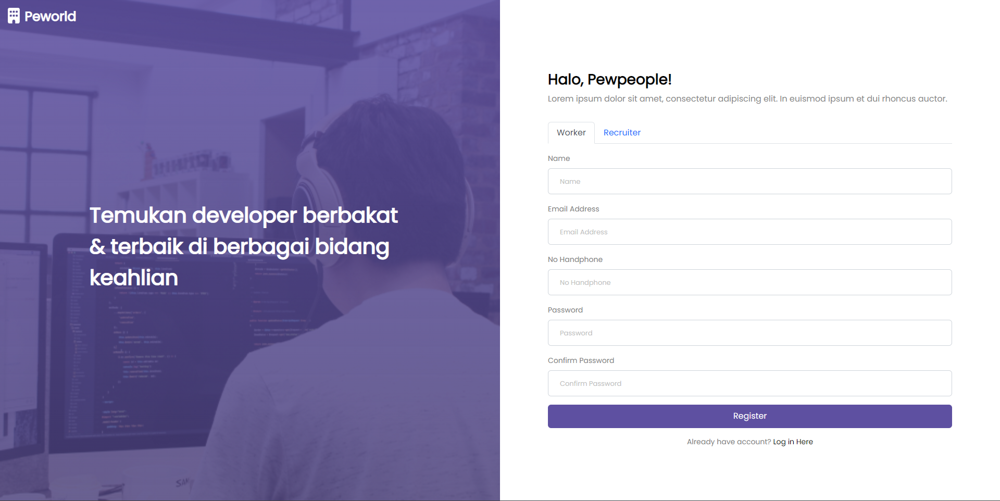
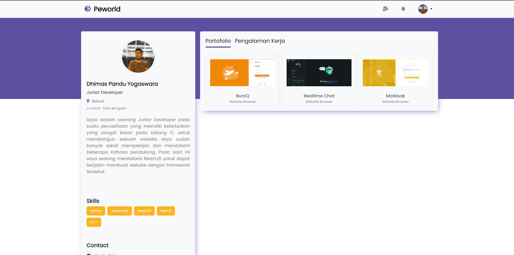
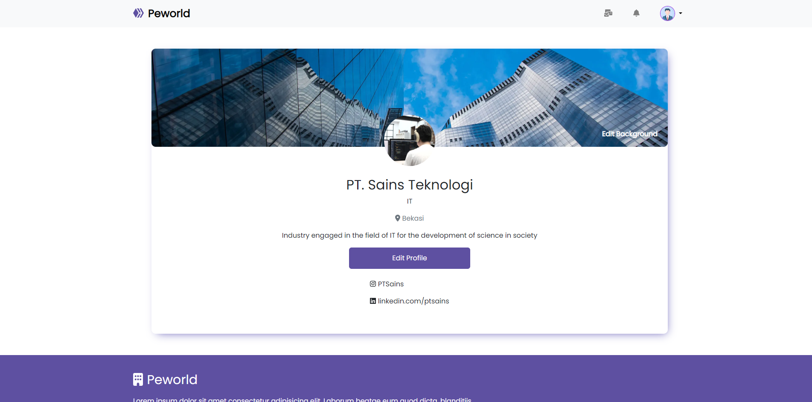

<p align="center">
<div align="center">
  
</div>
  <h3 align="center">Hiring App</h3>
  <p align="center">
    <a href="https://github.com/Dhimasswara/UI-HIREJOB"><strong>Explore the docs »</strong></a>
    <br />
    <a href="https://hirejob-kappa.vercel.app/">View Demo</a>
    <br />
    <a href="https://www.github.com/Dhimasswara/BE-HIREJOB">Api Demo</a>
  </p>
</p>

<!-- TABLE OF CONTENTS -->

## Table of Contents

- [Table of Contents](#table-of-contents)
- [About The Project](#about-the-project)
  - [Built With](#built-with)
- [Getting Started](#getting-started)
  - [Prerequisites](#prerequisites)
  - [Installation](#installation)
  - [Setup .env](#setup-env)
- [Screenshots](#screenshots)
- [Contributing](#contributing)
- [Related Project](#related-project)
- [Contact](#contact)

<!-- ABOUT THE PROJECT -->

## About The Project

Peeword is a hiring application designed to help users find jobs more easily through the application. This application allows users to create professional profiles, and search for jobs, and receive notifications about jobs that match predetermined criteria. Peeword also provides interaction features between users and recruiters or companies looking for workers to facilitate the process of communication and selection. By using Peeword, users can maximize their chances of getting the job they want effectively and efficiently.

<!-- GETTING STARTED -->

## Getting Started

### Prerequisites

This is an example of how to list things you need to use the software and how to install them.

- [nodejs](https://nodejs.org/en/download/)
- [Bootstrap Css](https://getbootstrap.com/)
- [Next JS](https://nextjs.org/)
- [Redux](https://redux.js.org/)

### Installation

- Clone This Front End Repo

```
git clone https://github.com/Dhimasswara/UI-HIREJOB.git
```

- Go To Folder Repo

```
cd UI-HIREJOB
```

- Install Module

```
npm install
```

- <a href="#setup-env">Setup .env</a>
- Type ` npm run dev` To Start Website
- Type ` npm run production` To Start Production

### Setup .env

Create .env.local file in your root project folder.

```
API_BACKEND = [BACKEND_URL]
```

<!-- ROADMAP -->

## Screenshots

<table>
 <tr>
    <td></td>
    <td> </td>
  </tr>
   <tr>
    <td>Register</td>
    <td>Login</td>
  </tr>
  
  <tr>
    <td></td>
    <td> </td>
  </tr>
   <tr>
    <td>Landing Page</td>
    <td>Search Recruiters</td>
  </tr>

  <tr>
    <td></td>
    <td> </td>
  </tr>
   <tr>
    <td>Profile Worker</td>
    <td>Profile Recruiter</td>
  </tr>

  <tr>
    <td></td>
  </tr>
   <tr>
    <td>Worker List</td>
  </tr>

</table>
<!-- CONTRIBUTING -->

## Contributing

Contributions are what make the open source community such an amazing place to be learn, inspire, and create. Any contributions you make are **greatly appreciated**.

1. Fork the Project
2. Create your Feature Branch (`git checkout -b feature/AmazingFeature`)
3. Commit your Changes (`git commit -m 'Add some AmazingFeature'`)
4. Push to the Branch (`git push origin feature/AmazingFeature`)
5. Open a Pull Request

## Related Project

:rocket: [`Backend Hiring App`](https://github.com/Dhimasswara/BE-HIREJOB)

:rocket: [`Frontend Hiring App`](https://github.com/Dhimasswara/UI-HIREJOB)

:rocket: [`Demo Hiring App`](https://hirejob-kappa.vercel.app/)

Project Link: [https://github.com/Dhimasswara/UI-HIREJOB](https://github.com/Dhimasswara/UI-HIREJOB)
